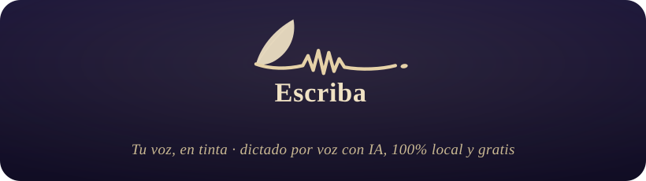

  

  
  
  
  

  <b>Dictado por voz con IA, 100% local y gratis.</b> 
  Aprietas un atajo, hablas, y tu voz aparece como texto en cualquier app. 
  Sin nube. Sin claves de API. Tu voz nunca sale de tu computador.

  <a href="https://github.com/AlejandroAP9/Escriba/releases/latest"><b>⬇️  Descargar la última versión</b></a>

---

## ✒️ Qué es Escriba

Escriba es una app de escritorio que convierte tu voz en texto con inteligencia artificial, **corriendo por completo en tu propia máquina**. No es solo dictado: es un motor de IA local del que cuelgan varias herramientas —corrección, traducción, transcripción de archivos, interpretación en vivo— sin que nada se envíe a internet y sin pagar una suscripción.

La idea es simple: **lo que otras apps cobran por mes y procesan en su nube, aquí es gratis, ilimitado y privado.**

## ⬇️ Descarga

Ve a **[releases/latest](https://github.com/AlejandroAP9/Escriba/releases/latest)** y elige el instalador de tu sistema:

| Sistema                                    | Archivo a descargar           |
| ------------------------------------------ | ----------------------------- |
| 🍎 **macOS** (Apple Silicon · M1/M2/M3/M4) | el `.dmg` que dice `aarch64`  |
| 🍎 **macOS** (Intel)                       | el `.dmg` que dice `x64`      |
| 🪟 **Windows** 10/11                       | el instalador `x64-setup.exe` |

> **Primera vez que abres la app:**
>
> - **macOS:** clic derecho sobre Escriba → **Abrir** → **Abrir** (Escriba aún no está firmada por Apple; esto solo se hace una vez).
> - **Windows:** si aparece SmartScreen, haz clic en **Más información** → **Ejecutar de todas formas**.

## 🚀 Qué puede hacer

|                                |                                                                                                                                                                                                                    |
| ------------------------------ | ------------------------------------------------------------------------------------------------------------------------------------------------------------------------------------------------------------------ |
| 🎙️ **Dictado con IA**          | Atajo global, hablas, y el texto aparece donde estés. Filtrado de silencios (VAD) + Whisper/Parakeet locales con aceleración por GPU.                                                                              |
| ✨ **Corrección con IA**       | Limpia muletillas y repeticiones, ordena listas y ajusta el tono según la app (WhatsApp casual, Mail formal, prompts para Cursor…).                                                                                |
| 🗣️ **Edición por voz**         | Selecciona texto en cualquier app, mantén el atajo y dile qué hacer: _"hazlo más formal"_, _"resúmelo en 3 líneas"_, _"tradúcelo al portugués"_.                                                                   |
| 🌐 **Traducción al dictar**    | Hablas en un idioma y el texto se pega en otro.                                                                                                                                                                    |
| 🎬 **Estudio**                 | Arrastra un audio o video (incluso notas de voz `.opus` de WhatsApp) → transcripción con marcas de tiempo → exporta **SRT / VTT / TXT / JSON** + **resumen con IA**. Subtítulos para tus Reels, gratis y sin nube. |
| 📡 **Intérprete en vivo**      | Tu Mac levanta una sala y muestra un **QR**; cada asistente lo abre en su teléfono y lee los subtítulos **en su propio idioma**. Para guías turísticos, clases y charlas con extranjeros.                          |
| 🔄 **Traductor cara a cara**   | Conversación 1-a-1 bidireccional con **detección automática de idioma**, pantalla grande y voz.                                                                                                                    |
| 🤖 **Agentes (MCP)**           | Un servidor local para que **Claude Code, Cursor o Cline** usen la transcripción, traducción y resumen de Escriba como herramientas. 100% local.                                                                   |
| 🎚️ **Re-transcribir**          | Mismo audio, otro modelo: compara precisión sin volver a subir nada.                                                                                                                                               |
| 🎤 **Micrófono en los campos** | Dicta directo dentro de la propia app, en cualquier campo de texto.                                                                                                                                                |
| 🔇 **Supresión de ruido**      | Limpia ventilador, teclado y tráfico del micrófono antes de transcribir. 100% local (RNNoise).                                                                                                                     |
| 🔁 **Buscar y reemplazar**     | Reglas propias (texto literal o expresión regular) que se aplican al texto dictado.                                                                                                                                |
| ⏯️ **Pausar la música**        | Pausa Música/Spotify mientras dictas y las reanuda al terminar; solo lo que estaba sonando.                                                                                                                        |

## 🔒 100% local, 100% gratis

- **Tu voz nunca sale de tu computador.** Toda la transcripción y la IA corren en tu máquina.
- **Sin claves de API en el camino feliz.** El motor local viene incluido; no necesitas cuenta ni tarjeta.
- **Ilimitado.** Sin cupos de palabras por semana ni límites de minutos.
- **Open source.** Puedes leer, auditar y extender cada línea.

## ⚙️ Cómo funciona

1. **Aprieta** el atajo configurable (o usa _push-to-talk_).
2. **Habla** mientras el atajo está activo.
3. **Suelta** y Escriba transcribe con el modelo que elijas.
4. **Listo:** el texto se pega en la app que estés usando.

Todo el procesamiento es local: el silencio se filtra con **Silero VAD**, la transcripción usa modelos **Whisper** (Small/Medium/Turbo/Large) o **Parakeet V3** (optimizado para CPU, con detección automática de idioma), y la corrección/traducción usa un **LLM local**.

## 🌍 Idiomas

Interfaz en **21 idiomas** (español primero) y transcripción multilingüe según el modelo elegido.

## 📜 Historial

Toda la evolución de Escriba, versión por versión (fechas reales de la dupla en los Juegos Imperiales):

| Versión | Fecha  | Novedades                                                                   |
| ------- | ------ | --------------------------------------------------------------------------- |
| 1.0.0   | 11-jul | Rebrand visual + español total                                              |
| 0.10.0  | 11-jul | **Agentes (MCP)** + re-transcribir + micrófono                              |
| 0.9.0   | 11-jul | **Traductor** cara a cara + lituano + copiar                                |
| 0.8.5   | 11-jul | **Intérprete en vivo** (QR)                                                 |
| 0.8.0   | 10-jul | **Supresión de ruido** + buscar/reemplazar                                  |
| 0.5.0   | 09-jul | Onboarding es-first + estadísticas                                          |
| 0.5.0   | 09-jul | **Estudio** (SRT + resumen, `.opus`)                                        |
| 0.4.0   | 08-jul | Háblale a cualquier texto (edición por voz)                                 |
| 0.3.0   | 08-jul | Poderes de dictado + traducción al dictar                                   |
| 0.2.0   | 07-jul | Rebrand + **motor de IA local**                                             |

## 🙏 Construido sobre Handy

Escriba es un _rework_ de **[Handy](https://github.com/cjpais/handy)**, la excelente app de dictado open source de **[CJ Pais](https://github.com/cjpais)**, publicada bajo licencia MIT. Gracias a CJ y a la comunidad de Handy por sentar unas bases tan sólidas y forkables. Escriba conserva esa filosofía —libre, privada, local— y le suma una capa de IA local (corrección, traducción, Estudio, Intérprete, Traductor y Agentes).

## 📄 Licencia

MIT. Ver [LICENSE](./LICENSE). El código original de Handy es © CJ Pais; las modificaciones de Escriba mantienen la misma licencia.

---

  Hecho con ✒️ para los <b>Juegos Imperiales</b> por <b>Alejandro</b> &amp; <b>Flor</b>.

